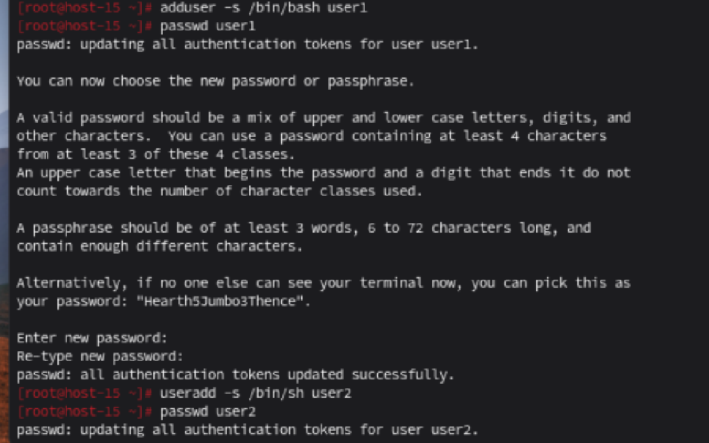
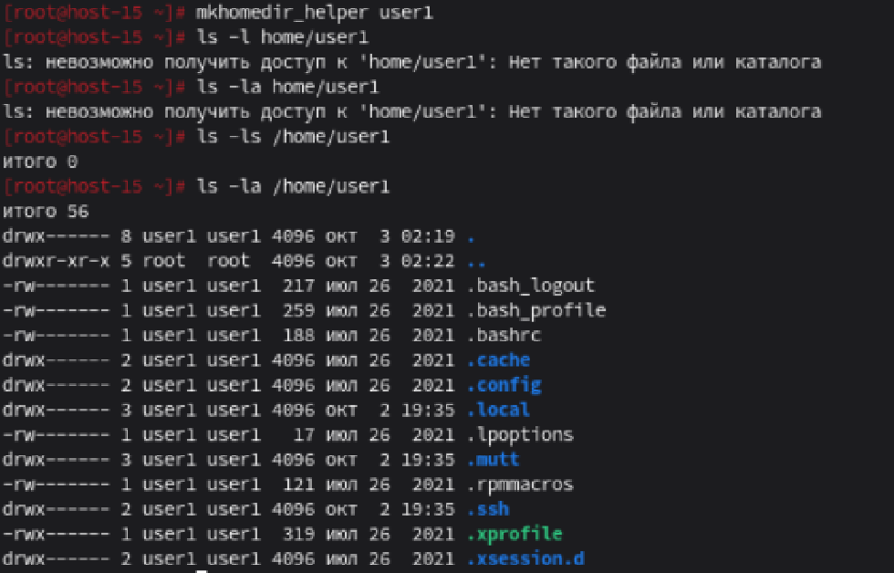

# Управление пользователями

1) Добавьте пользователей user1 и user2:
    1.1) user1 - оболочка bash
    1.2) user2 - оболочка sh
    1.3) установите им пароли

Ответ: Снимок в файле   

2) Назначьте пользователю 1 группу администраторов, польователя 2 добавте в группу пользователя 1
Ответ: Снимок в файле 

3) Что такое права доступа? Выведите права доступа на файлы в директории пользователя
Ответ: Снимок в файле 

4) Как изменить права на файлы? Создайте файл который будет на который у всез пользователей будут все возможные права
Ответ: Снимок в файле 
5) Как называется учётная запись встренного администратора в linux?
Ответ: Учётная запись встренного администратора в linux - root
6) Как выполнить команду от имени администратора?
Ответ: При помощи команды su - далее необходимо ввести пароли и произойдёт подключение от рута
7) Есть ли ограничения у суперпользователя?
Ответ: Суперпользователь имеет почти абсолютную власть в системе, но некоторые ограничения существуют: не может изменять неизменяемые файлы и может добавляться только к файлам, доступным только для добавления. Не удаётся выполнить запись в режим монтирования только для чтения или выполнить что-либо при монтировании без выполнения. Не может повторно смонтировать файловую систему в режиме чтения-записи, если её блочное устройство доступно только для чтения.Невозможно нарушить настройки SELinux.
8) Удалите пользователя 2 с помощью пользователя 1.
Ответ: удалил командой userdel. Вся команда: userdel -r user2
9) Как можно изменить владельца папки? измените владельца папки из пункта 4
Ответ: Владельца папки можно изменить при помощи команды chown, изменил владельца папки,
вся команда имеет вид: sudo chown bogdan:bogdan /home/bogdan/example.txt