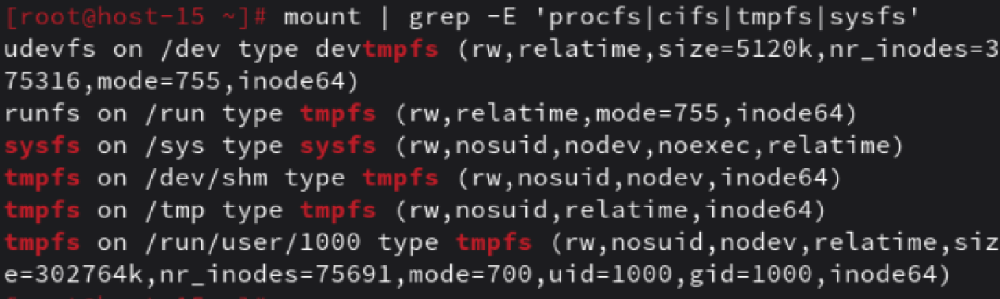
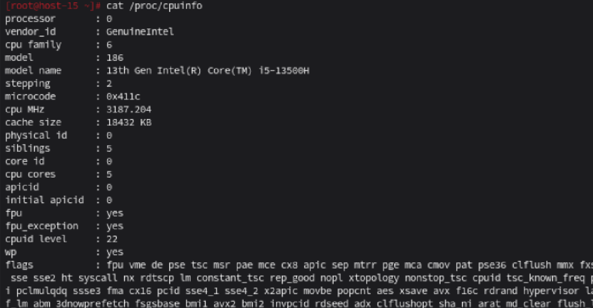

# ФС

1) Какие файловые системы вы знаете?
Ответ: NTFS на всех дисковых разделах и FAT32 (или NTFS) на флешках, HFS+, HFSX, APFS, WTFS для macOS. Числа в FAT12, FAT16 и FAT32 обозначают количество бит, используемых для перечисления блока файловой системы; Ext2, Ext3, Ext4,JFS, ReiserFS, XFS, Btrfs, ZFS - Linux.
2) Как можно классифиировать файловые системы? в чём отличия??
Ответ: Файловые системы можно классифицировать
* По операционной систему (Windows, MacOS, Linux)
* По структуры (Журналируемые (ext4, NTFS) - ведут журнал операций для повышения надежности при сбоях. Нежурналируемые (FAT32) - не имеют журнала, что ускоряет работу, но снижает отказоустойчивость)
3) Какие файловые системы используются в linux?
Ответ: Наиболее популярными файловыми системами в linux являтся: 1) Ext4 — основная журналируемая ФС Linux с поддержкой томов до 1 эксабайта и отложенным выделением места. 2) XFS - в отличие от Ext4 лучше масштабируется для больших томов, но ext4 гибче в управлении (поддержка сжатия, уменьшения размера), также имеет высокую производительность для больших файлов и многопоточных задач. 3) BTRFS - файловая система BTRFS (B-Tree Filesystem). BTRFS при работе с небольшими файлами (по умолчанию до 8К) хранит их непосредственно в метаданных, тем самым снижая накладные расходы и уменьшая фрагментацию диска 4)ZFS - В отличие от других файловых систем, ZFS совмещает возможности файловой системы и менеджера дисков. Это означает что ZFS может создать файловую систему охватив все диски. Copy-on-write это другая особенность zfs.В большинстве файловых систем, если информация перезаписана, она утрачена навсегда. В ZFS новая информация записывается в отдельный блок.
4) Как можно создать файловую систему на диске?
Ответ: Команда для создания файловой системы на диске - mkfs, общий синтаксис: mkfs [опции] [-t тип_фс] [опции_фс] устройство.
5) Как можно подключить диск в систему, что такое монтирование?
Ответ: Монтирование — это подключение файловой системы к дереву каталогов. 
6) файловая система procfs, cifs, tpmfs,sysfs. В чём особенности каждой из них?
Вывести каталоги к которым примонтированы эти файловые системыю
Ответ: procfs - виртуальная ФС, предоставляет доступ к информации о процессах и параметрах ядра в реальном времени, cifs (Common Internet File System) - сетевая файловая система для доступа к ресурсам Windows/Samba(реализует протокол SMB). Поддерживает аутентификацию, шифрование, работу с большими файлами. Требует установки пакета cifs-utils, tmpfs (Temporary File System) - Хранит данные в оперативной памяти (RAM), данные теряются при перезагрузке системы, sysfs (System File System) - виртуальная ФС, отображающая иерархию устройств, драйверов и классов ядра. Вывод каталогов к которым примонтированы файловые системы находится в файле: 
7) Как можно получить информацию о системе используя лишь команду cat?
вывести ифонмацию о процессоре и состоянии памяти системы
Ответ: Команда cat /proc/cpuinfo показывает информацию о процессоре, cat /proc/meminfo выводит информацию о состоянии памяти. Пример вывода показан в файле  .png) В первом файле вывод для процессора, во втором для памяти