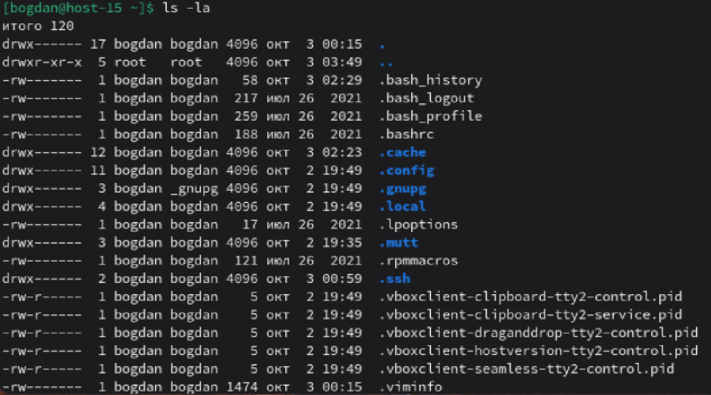

# Струтура каталогов

1) Какая структура каталогов в linux? выведите список файлов в корне системы
Ответ: Структура каталогов строится по стандарту FHS (Filesystem Hierarchy Standard).Linux использует иерархическую структуру каталогов, начинающуюся с корневого каталога /. Основные директории регламентируются стандартом FHS (Filesystem Hierarchy Standard), обеспечивающим единообразие в разных дистрибутивах. Список файлов в корне системы показан в файле:
2) Где хранятся папки пользователей в системе?
Ответ: Папки пользователей хранятся в директории /home/
3) Где домашняя папка суперпользователя?
Ответ: Домашняя папка суперпользователя находится в /root/
4) Где хранятся основые конфигурационные файлы в системе?
Ответ: Основные конфигурационные файлы находится в /etc/
5) Что за папки /bin,/sbin,usr/sbin,/usr/sbin
Ответ: 
* /bin - это системный каталог, содержащий основные исполняемые файлы (команды), необходимые для базовой работы системы даже в аварийных режимах (например, при загрузке в однопользовательском режиме или при повреждении других разделов). 
* /sbin - это системный каталог, содержащий исполняемые файлы для администрирования системы, которые обычно требуют прав суперпользователя (root). Эти команды критичны для настройки, восстановления и управления ОС на низком уровне. 
* usr/bin - каталог, содержащий исполняемые файлы программ, установленных через пакетные менеджеры (например, apt, dnf, pacman). Эти программы доступны всем пользователям системы, но не являются критичными для загрузки ОС (в отличие от команд из /bin)
* usr/sbin - системные административные утилиты, которые не критичны для ранних этапов загрузки системы, в отличие от /sbin