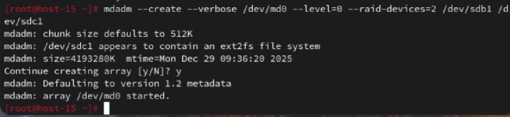
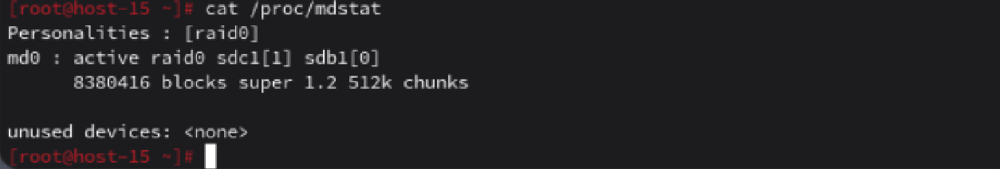
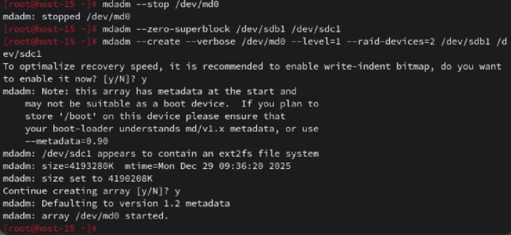

# Продолжаем

1. Raid массивы, что такое икакие бывают
Ответ: RAID-массивы (Redundant Array of Independent Disks) — это технология, объединяющая несколько физических дисков в один логический массив для повышения производительности, надежности или увеличения объема хранения данных. 
* RAID 0 (Striping) - Данные разделяются на блоки и распределяются («размазываются») по всем дискам. Нет отказоустойчивости. Поломка одного диска приводит к потере всех данных.
* RAID 1 (Mirroring) - Данные дублируются (зеркалируются) на два или более диска. Полная отказоустойчивость при выходе из строя одного диска. Быстрое чтение.
* RAID 5 (Striping + Parity) - Данные и информация для восстановления («четность») распределяются по всем дискам. Отказоустойчивость (выдерживает поломку одного диска). Эффективное использование емкости. Минимальное количество дисков - 3.
* RAID 10 - комбинация RAID 1 и RAID 0. Диски разбиваются на зеркальные пары, а данные распределяются между ними. Высокая скорость и отказоустойчивость (выдерживает поломку одного диска в каждой паре).
2. Добавьте в виртуальную машину 2 диска отформатируйте их в ext4
Ответ: По аналогии с заданием 3 создаю диск(так как один уже был создан ранее) и отформатирую в ext 4
3. Создайте из них raid 0 массив
Ответ: Снимок в файле 
4. Проверье всё ли работает
Ответ: Снимок в файле 
5. Удалите raid0 и создайте raid1
Ответ: В начале останавливаем RAID 0 и удаляем из него суперблоки. Удаление суперблоков предотвращает случайное или автоматическое "присоединение" этих дисков к другому массиву, другими словами в суперблоке содержатся метаданные, которые "помнят", что диск был когда-то частью какого-то RAID массива. После описанных операций создаём RAID 1 массив
Ответ: Снимок в файле 
6. В чём между ними разница?
Ответ: Разница в основных принципах работы(описаны выше), также RAID 0 и RAID 1 создаются для разных задач. RAID 0 - в случае если нужна скорость и есть возможность восстановить данные, а RAID 1 - для надёжности и защиты от потери данных.
7. Есть ли файловые системы которые поддерживают raid массивы без стороненго ПО
Ответ: Да, например Btrfs или ZFS
8. Можно ли создать raid массив во время установки системы?
Ответ: Да, в Linux можно создать RAID-массив прямо во время установки системы, используя установщик дистрибутива  или переключившись в другую консоль для ручного создания с помощью mdadm и разметки дисков под тип "Linux RAID" (fd) перед установкой.
