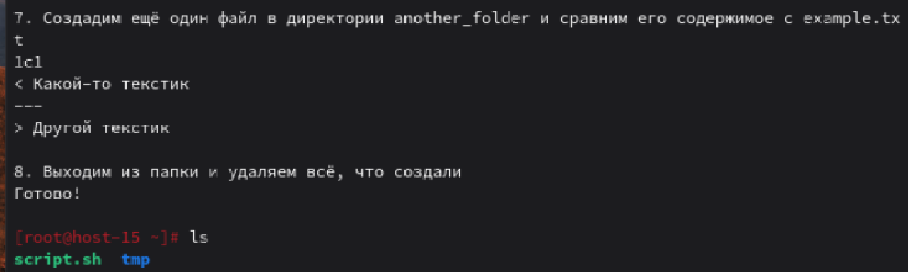
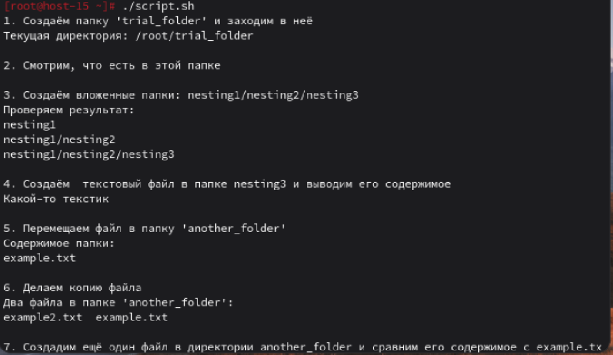

# Скриптуем по полной

1. Что такое шебанг?
Ответ: это специальная строка в начале скрипта (например, Bash, Python, Perl), которая указывает операционной системе, какой интерпретатор использовать для его выполнения. Синтаксис: #!<путь_к_интерпретатору>
2. Обязательно ли исполняемый файл дожен иметь соотвествующее расширение?
Ответ: Нет, не обязательно. В Linux расширение файла не определяет его тип.
3. Напишите скрипт который выполнит автоматически действия из блока работы с файлами. ( не забудьте включить set -euo pipefail для того что бы ваш скрипт было удобнее отлаживать. Опишите что включают эти флаги)
Ответ:
Описание флагов:
 1) e  - Немедленно завершает скрипт при первой же ошибке (если команда возвращает ненулевой статус выхода).
 2) -u (nounset) - Считает использование неопределённой переменной ошибкой. По умолчанию Bash подставляет пустую строку вместо несуществующей переменной. 
 3) -o pipefail - устанавливает статус всего конвейера (pipeline) как статус последней команды, которая завершилась с ошибкой. По умолчанию статус конвейера — это статус последней команды.
```bash
#!/usr/bin/bash
set -euo pipefail
echo "1. Создаём папку 'trial_folder' и заходим в неё"
mkdir -p trial_folder
cd trial_folder
echo "Текущая директория: $(pwd)"
echo
echo "2. Смотрим, что есть в этой папке"
ls
echo
echo "3. Создаём вложенные папки: nesting1/nesting2/nesting3"
mkdir -p nesting1/nesting2/nesting3
echo "Проверяем результат:"
find nesting1
echo
echo "4. Создаю текстовый файл в папке nesting3"
echo "Какой-то текстик" > nesting1/nesting2/nesting3/example.txt
cat nesting1/nesting2/nesting3/example.txt
echo
echo "5. Перемещаем файл в папку 'another_folder/'"
mkdir -p another_folder
mv nesting1/nesting2/nesting3/example.txt another_folder/
echo "Содержимое папки:"
ls another_folder
echo
echo "6. Делаем копию файла"
cp another_folder/example.txt another_folder/example2.txt
echo "Два файла в папке 'another_folder':"
ls another_folder
echo
echo "7. Создадим ещё один файл в директории another_folder и сравним его содержимое с example.txt"
echo "Другой текстик" > another_folder/example3.txt
diff another_folder/example.txt another_folder/example3.txt || true
echo "8. Выходим из папки и удаляем всё, что создали"
cd ..
rm -rf trial_folder
echo "Готово!"
echo
```
Стоит отметить, что у меня несколько раз возникали различные ошибки, но их вывод я не демонстрирую, потому что они были не очень интересными. Единственная неожиданная проблема, с которой я столкнулся было, то, что у меня не выводилась 8 команда(с удалением). Так как у нас стоит флаг -e он завершает скрипт при получении ненулевого кода возврата, который возвращает diff(из-за отличия в файлах). Чтобы скрипт продолжил выполнятся мы ставим || true, чтобы игнорировать её ненулевой статус.
Снимки с выполнением находятся в файлах 