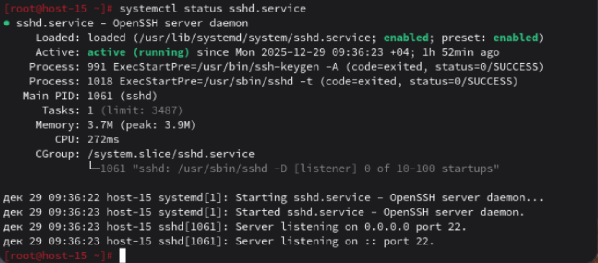
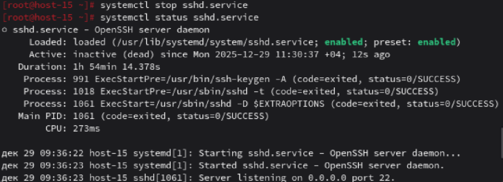
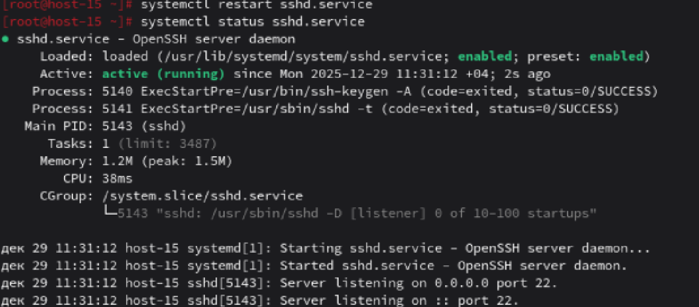
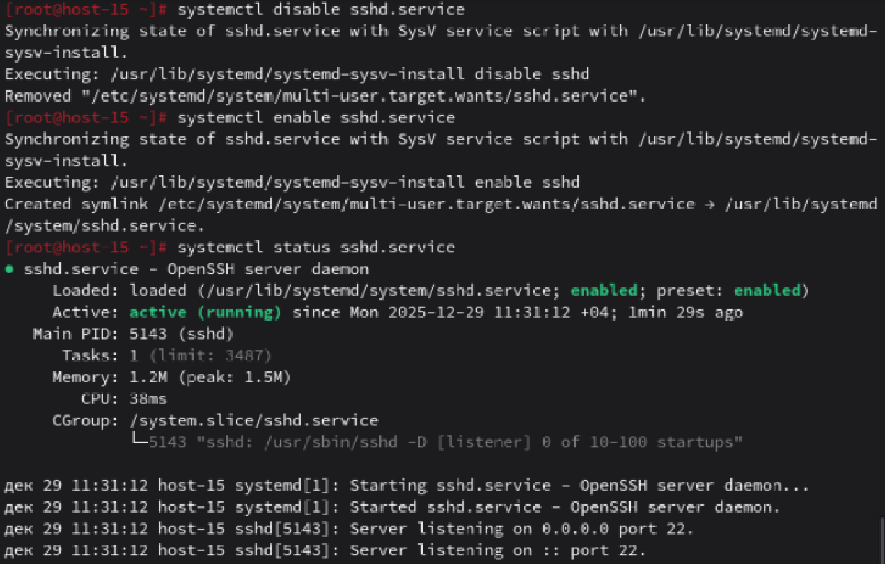

# Юниты

1. Что такое systemd юнит?
Ответ: systemd unit — это конфигурационный файл, описывающий ресурс или службу, которым управляет systemd — современная система инициализации и управления сервисами в Linux. Юниты определяют, как systemd должен запускать, останавливать, мониторить и взаимодействовать с процессами, устройствами, точками монтирования и другими компонентами системы.
2. Проверье статус любого systemd юнита, какую информацию выводит эта кманда?
Ответ: Снимок в файле 
3. ПОпробуйте оставновить сервис.
Ответ: Снимок в файле 
4. Перезапустите его.
Ответ: Снимок в файле 
5. УДалите из автозагрузки
Ответ: Снимок в файле 
6. Верните обратно
Ответ: Показано выше
7. Что такое таймеры?
Ответ: Это юниты, которые позволяют планировать запуск других юнитов (как правило, сервисов или скриптов) по времени.