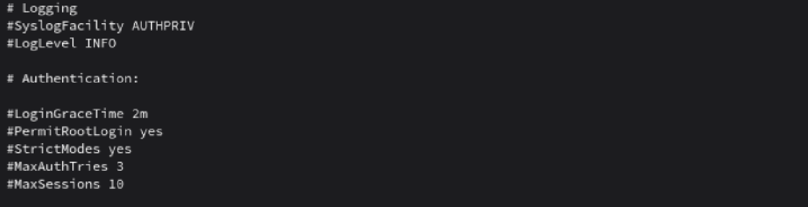
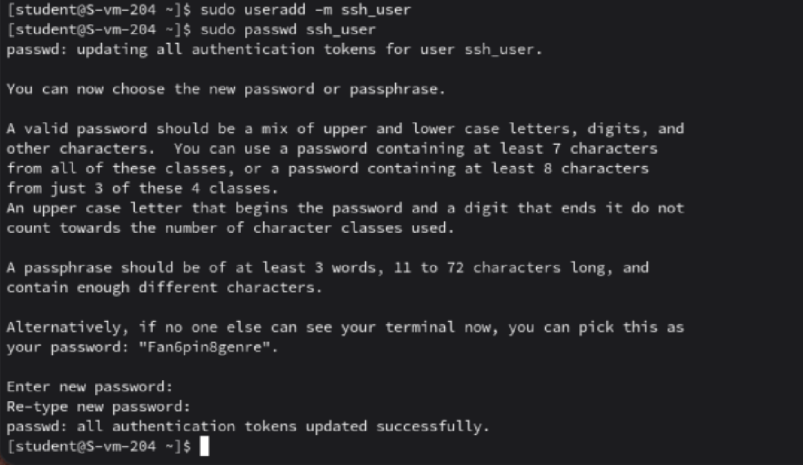
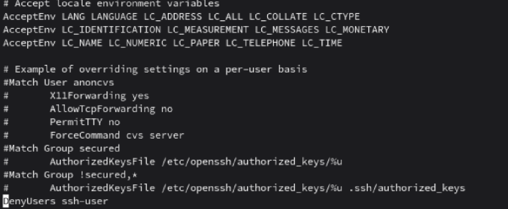

# Настриваем

1. Какой по умолчанию используется порт для поключения?
Ответ: По умолчанию SSH использует порт 22.
2. Можно ли его изменить? если да то как?
Ответ: Да, для этого нужно отредактировать файл конфигурации SSH-сервера, а именно раскомментировать директиву Port и изменить значение 22 на необходимое.
3. Какая служба отвечает за обработку запросов на подключения по ssh?
Ответ: За обработку запросов отвечает sshd
4. Какой файл конфигурации отвечает за его настройку?
Ответ: Файл, находящийся по пути: /etc/ssh/sshd_config
5. Попробуйте подключиться по ssh к предоставленному вам серверу
Ответ: Подключился, забыл сделать скриншот, но по скринам далее будет видно, что я подключился, мой номер в Ipsilon 4, соответственно порт 204
6. Отредактируйте файл настроек на сервере так, чтобы была возможность подключиться к серверу используя пользователя root
Ответ: Снимок в файле . Написал yes в параметре PermitRootLogin
7. Измените колличество ошибок ввода пароля перед сборосом соединения, покажите эти измененения
Ответ: Снимок в файле  Поменял параметр MaxAuthTries на 3
8. Создайте пользователя ssh-user и попробуйте им подключиться к серверу
Ответ: Сначала создал пользователя, а затем подключился им к серверу.
Снимки в файле 
9. Ограничьте ему возможность подключения к серверу
Ответ: Снимок в файле  Добавил в директорию /etc/openssh/sshd_config в последнюю строку DenyUsers и указал пользователя ssh-user
10. Как вы это сделали?
Ответ: Описал выше
11. Что хранится в файле known_hosts?
Ответ: В файле known_hosts хранятся публичные ключи всех серверов, к которым пользователь когда-либо подключался.