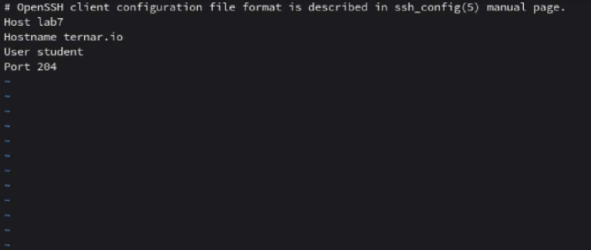
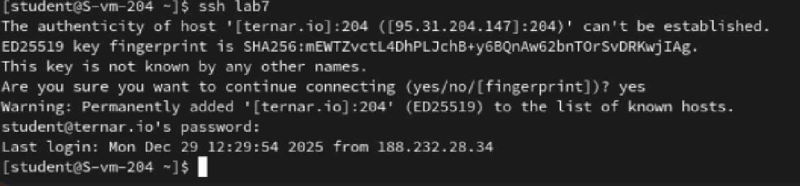

# Конфижим для удобства

1. Где хранятся пользвательские и системные настройки подключения?
Ответ: Пользовательские настройки хранятся в домашнем каталоге по адресу ~/.ssh/config, а системные настройки для всех пользователей - в файле /etc/ssh/ssh_config
2. Что за файл options?
Ответ: Конфигурационный файл SSH-клиента, в нём можно задавать параметры подключения для различных хостов.
3. Отредактируйте файл options так, чтобы можно было подключаться не вводя имя пользвателя и порт
Ответ: При помощи vi изменил содержимое файла ~/.ssh/config фото:
4. Назовите подключение удобным для вас спсобом
Ответ: Назвал lab7, хотел оригинальнее, но длинное название потом не очень удобно использовать
5. Проверьте работоспособность
Ответ: Проверил работоспособность: 