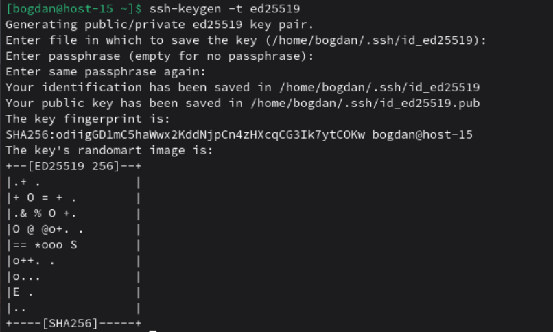
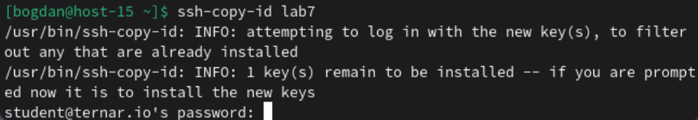
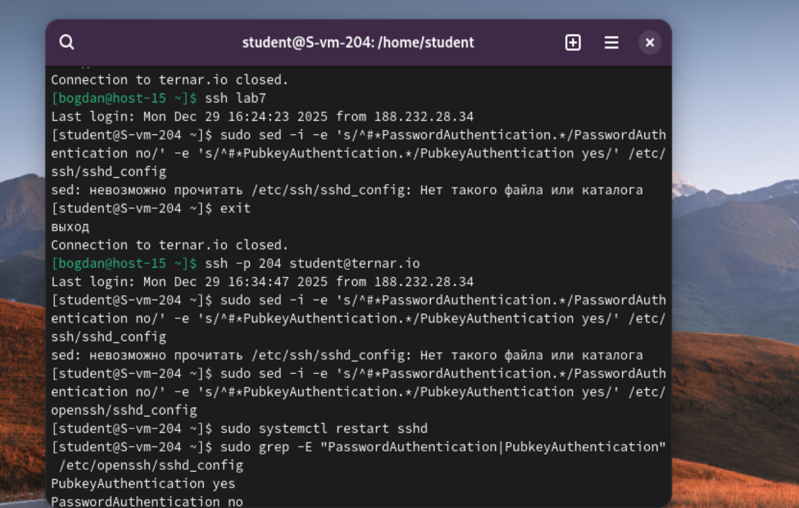

# Ключики

1. Что такое ssh ключи и зачем они нужны?
Ответ: SSH-ключи — это пара криптографических ключей (публичный и приватный), используемых для безопасной аутентификации на удалённых серверах через протокол SSH. В отличие от паролей, они обеспечивают более высокий уровень безопасности и удобство.
2. Как их создать?
Ответ: Ключи создаются специальной утилитой ssh-keygen. Она генерирует два файла: один приватный у пользователя, а второй публичный отправляется на сервер
3. Создайт пару публичный/приватный ключ ed_25519, где они хранятся?
Ответ: Создал ключи, они лежат в папке ~/.ssh/ 
4. Скопируйте публичный ключ на ваш сервер, в каком файле он будет храниться?
Ответ: Он будет хранится в файле в файле /home/scriptuser/.ssh/autorized_keys

5. Попробуйте подключиться к серверу, у вас запросили пароль?
Ответ: Вход теперь доступен без пароля 
6. Запретите подключение с паролем для всех пользователей, оставьте только с помощью ключа.
Ответ: При помощи команды sudo sed -i -e 's/^#*PasswordAuthentication.*/PasswordAuthentication no/' -e 's/^#*PubkeyAuthentication.*/PubkeyAuthentication yes/' /etc/openssh/sshd_config. Процесс показан в файле: