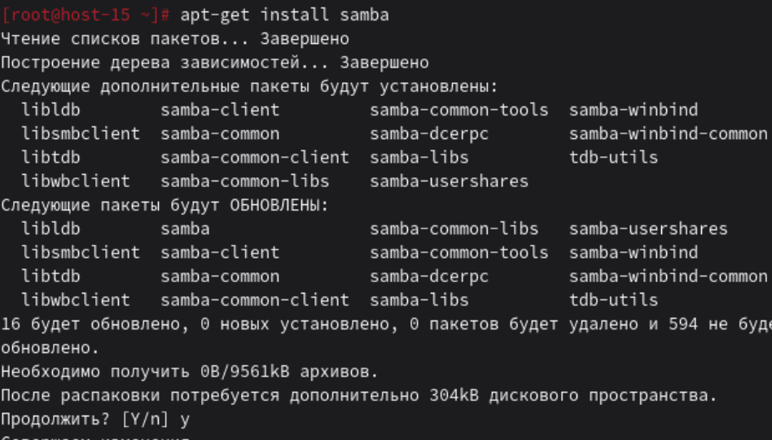
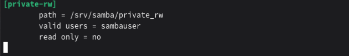
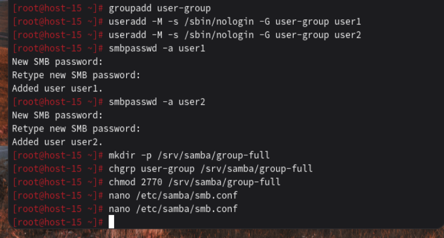
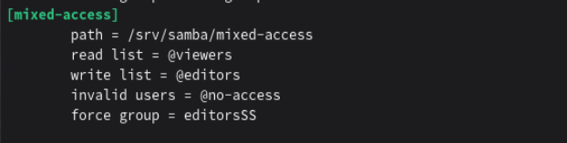

# Шарим

1. Установите пакет samba
Ответ: Скрин:
2. Что такое общая папка, зачем оно может быть нужно?
Ответ: Общая папка (share) — это директория в сети, доступная нескольким пользователям или компьютерам. Нужно для обмена файлами между разными ОС, централизованное хранилище (один источник файлов для всех), несколько пользователей работают с одними файлами, доступ к фильмам/музыке с разных устройств 
3. Создайте общую папку без пароля с правами только на чтение файлов
Ответ: Создаём общую папку с правом 555 - только для чтения Скрин: 
.png)
4. Создайте общую папку с паролем с правами на чтение и запись
Ответ: Скрин: .png)
5. Создайте общую папку с доступом для какой-то группы с полными правами
Ответ: Скрин:
6. Создайте общую папку в которой у одной группы будет полный доступ, а у другой только доступ на чтение.
Третья группа не должна иметь к ней доступа
Ответ: Скрин: .png)