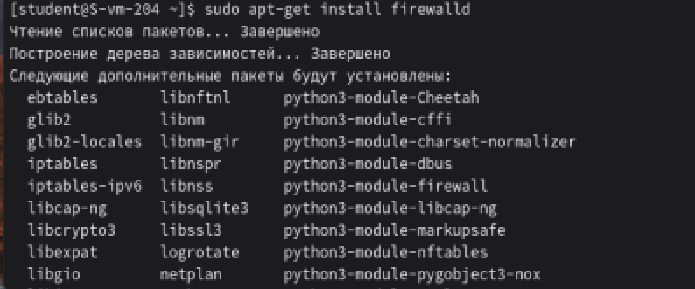
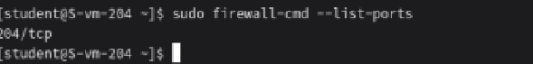
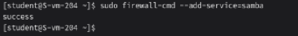
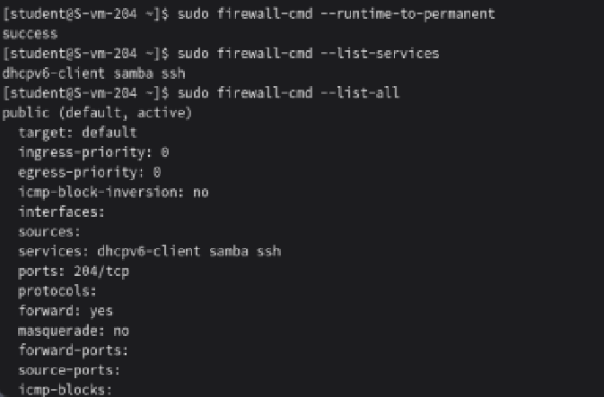

# Открываем firewald

1. Удалите iptables и установите firewalld
Ответ: sudo apt-get remove iptables - удаление iptables
sudo apt-get install firewalld - установка firewalld
2. Попробуйте так-же проверить возможность подключения по ssh
Ответ: Не подключилось по ssh
3. Если её нет то откройте порт
Ответ: Открываю порт командой `sudo firewall-cmd --add-port=204/tcp`, снимок в файле 
4. Выведите список открытых портов с помощью firewall-cmd
Ответ: Снимок в файле 
5. Можно ли там добавить порты по названию сервиса?
Ответ: Да, можно Firewalld использует предопределённые сервисы.
6. На вашей Локальной виртуальной машине попробуйте подключиться к серверу samba из предыдущих заданий
Ответ: не получается открыть
7. Если не получилось то откройте нужные порты
Ответ: Открываю порт сервиса Samba командой sudo firewall-cmd --add-service=samba
Снимок в файле 
9. Сделайте так чтобы изменения были постоянными
Ответ: firewall-cmd --runtime-to-permanent делает изменения постоянными, проверяем, что всё получилось командой: sudo firewall-cmd --list-all
Снимок в файле 